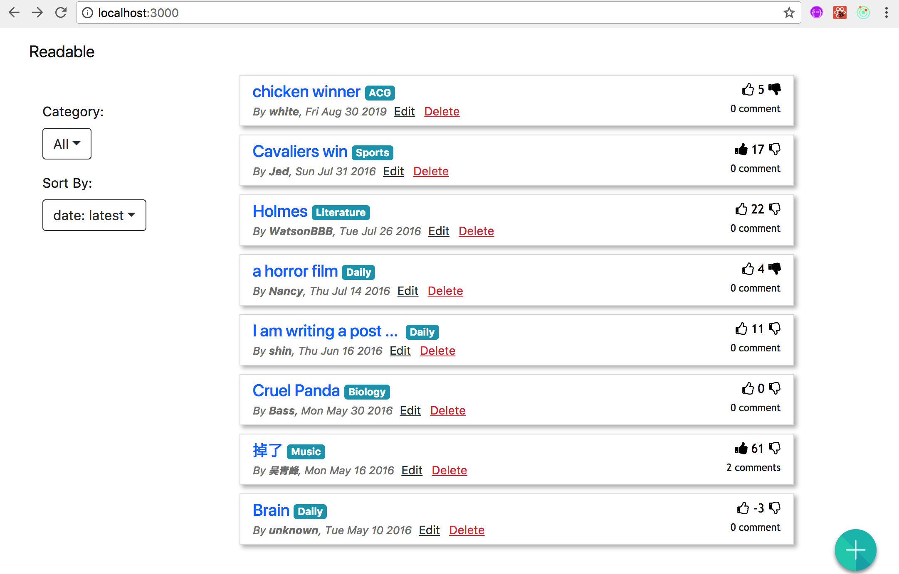
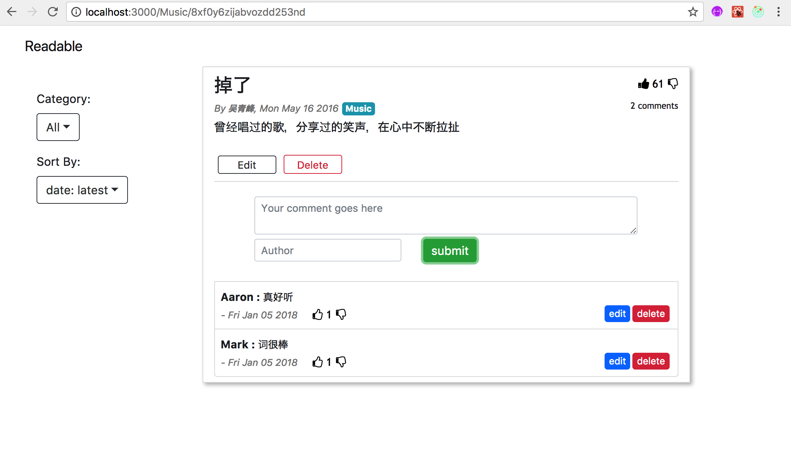

# myReadable
Readble is a prototype of online post management website. </br>
It is based and React and Redux. </br>
The server is developed with Nodejs using Koa. The databse is MongoDB. </br>




## Functionality
- Browse all posts by category in different orders
- Create/Edit/Delete/Vote/Comment a post
- Create/Edit/Delete/Vote a comment

## Folder Struture
```
- api-server
  .gitignore
  config.js
  db.js
  package.json
  server.js
  yarn.lock
  -controller
    category_controller.js
    comment_controller.js
    post_controller.js
  -data
    category_data.json
    comments_data.json
    post_data.json
- frontend
    package-lock.json
    package.json
    yarn.lock
    -public
       index.html
       manifest.json
       favicon.ico
    -src
       App.css
       App.js
       index.js
       regiesterServiceWorker.js
       -actions
          category_action.js
          comment_action.js
          index.js
          post_action.js
          view_actionjs
       -components
          CategorySelect.js
          Comment.js
          CommentItem.js
          EditModal.js
          HeadBar.js
          PostCard.js
          PostDetail.js
          PostList.js
          PostModal.js
          SideBar.js
       -icons
          add.svg
          up.svg
          up-o.svg
          down.svg
          down-o.svg
       -reducers
          category_reducer.js
          comment_reducer.js
          post_reducer.js
          view_reducer.js
          index.js
       -utils
          api.js
          utility.js
```

## Install and Launch
0. Make sure you have [MongoDB server](https://www.mongodb.com) installed on your machine. You might want to configure the uri of your database at the first line of **api-server/db.js**
1. Install dependency: Run `npm install` in *BOTH* **api-server/** and **frontend/** folder.  </br>
2. Start Server: run `yarn start` under **api-server/**.
3. Launch : In **frontend/**, run `npm start`, and you will be directed to http://localhost:3000 in your browser and see the website.

## Note
- Voting mechanism: Since the server does not provide api for saving voting status, you can vote for a post or a comment infinite times as long as you refresh the webpage. 
